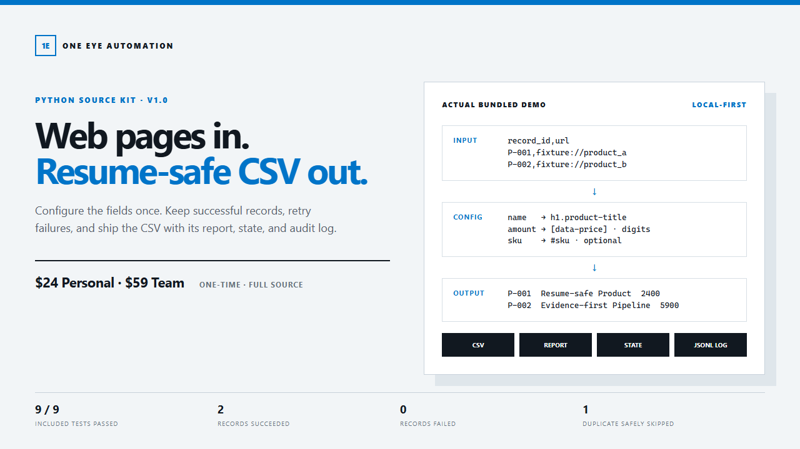
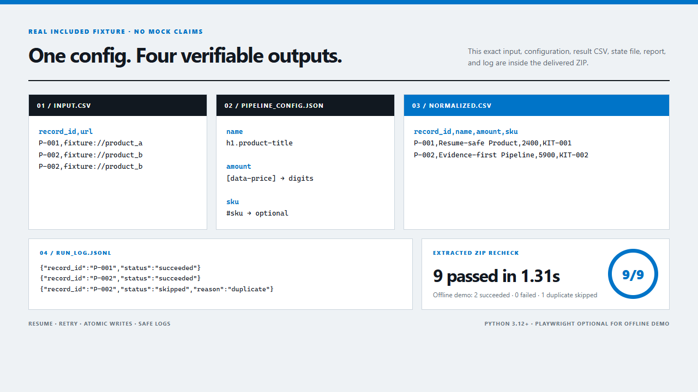

# Resumable Web-to-CSV Pipeline Kit

A tested Python + Playwright source kit for collecting structured data from
pages you own or have permission to automate.

[Buy Personal for $24 or Team for $59](https://lovelife717.gumroad.com/l/resumable-web-to-csv-pipeline)

## What is included

- Config-driven URL, field, selector, and output settings
- Retry handling for transient failures
- Resume state that skips completed records after interruption
- Duplicate-ID protection
- Atomic CSV and state-file writes
- Safe JSONL logs and an HTML run report
- Offline fixture demo, tests, and full Python source

The extracted delivery archive passed **9/9 tests**. Its included demo processed
**2 records successfully, 0 failed, and skipped 1 duplicate safely**.

## Licenses and delivery

- **Personal:** 1 user
- **Team:** up to 5 users in one legal entity

Release assets are AES-encrypted. Gumroad shows the matching download link and
password only after purchase. Personal and Team archives contain their
respective license files.

## Scope

This kit is for pages the operator owns or is permitted to automate. It does not
bypass login, CAPTCHA, access controls, rate limits, robots rules, or website
terms. Custom development, custom selectors, remote setup, ongoing support, and
future updates are not included.
